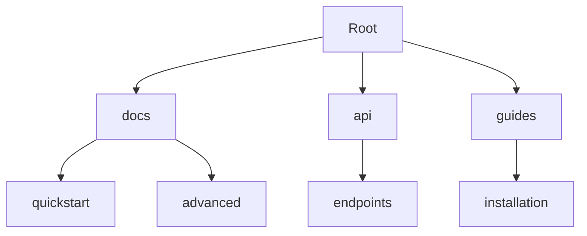

## Overview

Organize your Devansh Sharma Documentation projects effectively to keep content accessible and scalable. You structure folders logically, add pages with rich MDX components, integrate version control, and enable team collaboration. This guide walks you through each step.

<Columns cols={3}>
  <Card title="Project Structure" icon="folder" href="#project-structure">
    Set up folders and hierarchies for easy navigation.
  </Card>
  <Card title="Add Pages" icon="file-text" href="#adding-pages">
    Create and edit MDX pages with visual editors.
  </Card>
  <Card title="Version Control" icon="git-branch" href="#version-control">
    Track changes with Git integration.
  </Card>
</Columns>

## Project Structure and Folders

Define a clear folder structure to mirror your project's architecture. Start with top-level folders like `docs/`, `api/`, and `guides/`. Nested folders handle specific topics, such as `guides/quickstart/` or `api/reference/`.



Use this hierarchy:

| Folder       | Purpose                          |
|--------------|----------------------------------|
| `docs/`      | Core documentation               |
| `api/`       | API references and schemas       |
| `guides/`    | Tutorials and workflows          |
| `changelog/` | Release notes                    |

<Callout kind="tip">
  Limit nesting to three levels to avoid deep navigation paths.
</Callout>

## Adding and Editing Pages

Create new pages directly in the platform or via your file system. Use the visual editor for MDX components or edit raw files for precision.

<Tabs>
  <Tab title="Visual Editor" icon="edit-3">
    <Steps>
      <Step title="Create Page" icon="plus">
        Click "New Page" and select location.
      </Step>
      <Step title="Add Content" icon="file-text">
        Use drag-and-drop for components like `<Callout>` or `<Steps>`.
      </Step>
      <Step title="Preview" icon="eye">
        Review live preview before publishing.
      </Step>
    </Steps>
  </Tab>
  <Tab title="File System" icon="folder">
    Add `.mdx` files to your repo.
  </Tab>
</Tabs>

For custom components, write valid MDX:

<CodeGroup tabs="MDX Example">
```mdx
---
title: My Page
description: Page content.
---

## Introduction

Use `<Card title="Feature" />` for navigation.
```
</CodeGroup>

## Version Control Basics

Integrate Git to track changes. Commit frequently with descriptive messages.

<CodeGroup tabs="npm,yarn">
```bash
npm install docs-platform --save
git add .
git commit -m "Add organizing guide"
git push origin main
```
```bash
yarn add docs-platform
git add .
git commit -m "Update project structure"
git push origin main
```
</CodeGroup>

<Callout kind="info">
  Enable branch protection for `main` to prevent accidental overwrites.
</Callout>

## Collaboration Features

Invite team members and assign roles. Use comments, pull requests, and real-time editing.

<ExpandableGroup>
  <Expandable title="Role Permissions" default-open="true">
    | Role     | Can Edit | Can Publish | Can Delete |
    |----------|----------|--------------|------------|
    | Admin    | Yes     | Yes         | Yes       |
    | Editor   | Yes     | No          | No        |
    | Viewer   | No      | No          | No        |
  </Expandable>
  <Expandable title="Pull Requests Workflow">
    Create branches for features, review changes, then merge.
  </Expandable>
</ExpandableGroup>

Follow these practices to maintain organized documentation: structure early, commit often, and collaborate via PRs. Your projects stay scalable and team-friendly.